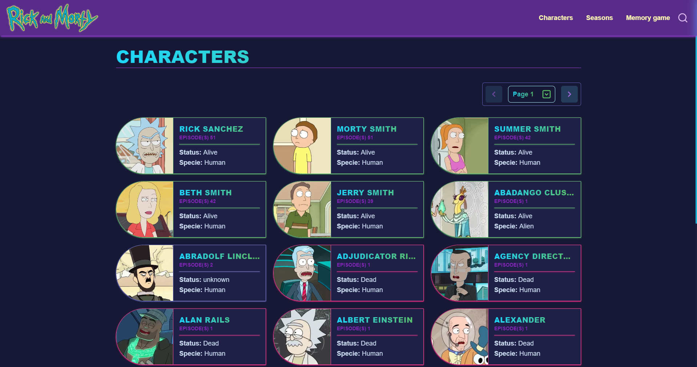
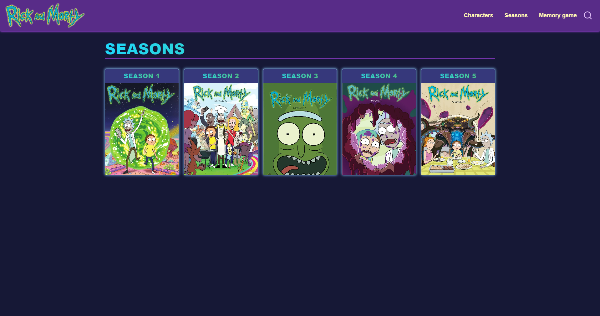
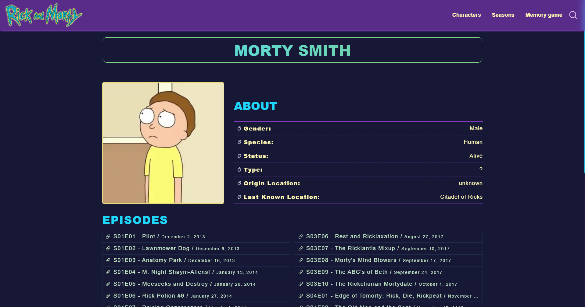
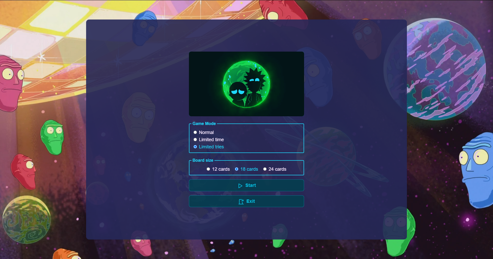

# Challenge de la comunidad Gentleman Programming - **[Go to the App](https://rick-morty-app-jet.vercel.app/)**






## Tech Stack

- [React](https://reactjs.org/)
- [NextJS](https://nextjs.org/)
- [Tailwindcss](https://tailwindcss.com/)
- [Typescript](https://www.typescriptlang.org/)
- [radix-ui](https://www.radix-ui.com/)
- [react-query](https://tanstack.com/query/v4)
- [framer Motion](https://www.framer.com/motion/)
- [zod](https://zod.dev/)
- [zustand](https://zustand-demo.pmnd.rs/)

## Variables de entorno

Para iniciar este proyecto, tendras que añadir las siguientes variables de entorno a tu archivo .env

`NEXT_PUBLIC_WEB_URL`

`NEXT_PUBLIC_RICK_MORTY_BASE_URL`

## Como iniciar el proyecto

Clonar el proyecto

```bash
  git clone https://github.com/JPerezC92/challenge-rick-morty.git
```

Ir al directorio del proyecto

```bash
  cd challenge-rick-morty
```

Instalar las dependencias

```bash
  npm install
```

Iniciar la aplicación

```bash
  npm run dev
```
